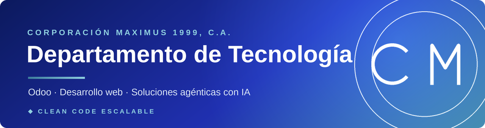

  

&nbsp;

&nbsp;

 

## 🏢 Quiénes somos

**Corporación Maximus 1999, C.A.** es una empresa **distribuidora** de productos al **mayor y al detal**. Nuestro **Departamento de Tecnología** desarrolla y mantiene las soluciones de software de la empresa — y presta servicios a **clientes externos**.

 

## ⚙️ Qué hacemos

<table width="100%">
<tr>
<td width="33%" valign="top">

### 🧩 Implementaciones Odoo
**Nuestro fuerte y especialidad.** Configuración, módulos a medida, migraciones, integraciones y soporte continuo.

</td>
<td width="33%" valign="top">

### 🌐 Desarrollo web
**Sitios y aplicaciones a medida.** Del sitio corporativo a la aplicación de negocio.

</td>
<td width="33%" valign="top">

### 🤖 Soluciones agénticas
**Agentes de IA aplicados al negocio.** Automatización de procesos y asistentes inteligentes, integrados con tus sistemas — Odoo incluido.

</td>
</tr>
</table>

 

## 🧰 Stack

 

## 🔒 Cómo trabajamos

> **Escribimos siguiendo estándares → el control de calidad automático lo confirma → si algo falla, no sube.**

Trabajamos con **estándares versionados** y **control de calidad automático** (linters + revisión por PR). Nuestro norte es **clean code escalable**: software mantenible, probado y consistente — sin atajos.

 

## 📧 Contacto

  

⎯⎯⎯⎯⎯⎯⎯⎯⎯⎯⎯⎯⎯⎯⎯⎯⎯⎯⎯⎯⎯⎯⎯⎯⎯⎯ 
© 2026 <b>Corporación Maximus 1999, C.A.</b> · Departamento de Tecnología

